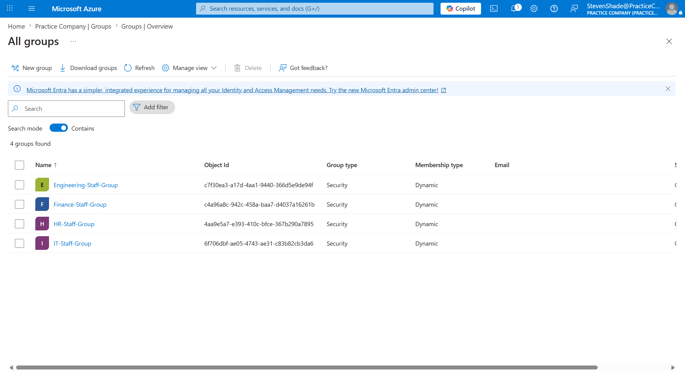
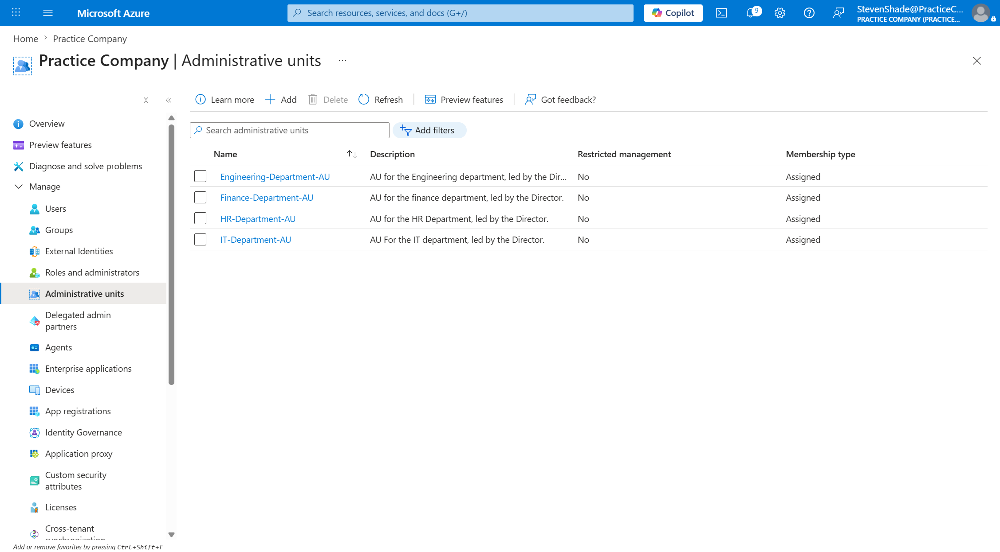
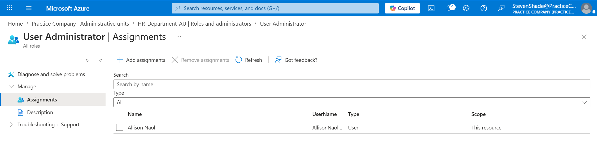

# Phase 1: Identity, Access Control, and Governance

## Business Scenario
`Practice Company` is a tech startup that focuses on automated inventory tracking for local retailers. To support operations, the Azure tenant will have four separate departments utilizing different groups and Administrative Units: IT & Security, Finance, Human Resources, and Engineering. 

## Step-by-Step Implementation
### Step 1: Add Users
Each department in the 'Practice Company' has hired a department head and 1-2 new employees. All employees were created and added to the Entra ID directory. 

*Figure 1: Verified roster provisioned within the Practice Company tenant directory.*

### Step 2: Groups and Administrative Units
To avoid managing individual accounts, all employees were organized into appropriate security groups (e.g., `IT-Staff-Group`, `HR-Staff-Group`). To reduce creation time, users were auto-assigned into each group using dynamic memberships. 

*Figure 2: Formed dynamic membership groups to automate member type.*

The basic dynamic membership rules syntax used to populate each group:
* **Engineering:** `(user.department -eq "Engineering")`
* **Finance:** `(user.department -eq "Finance")`
* **Human Resources**: `(user.department -eq "Human Resources")`
* **IT & Security:** `(user.department -eq "IT & Security")`

Administrative boundaries were set by implementing Administrative Units (AU). Each security group that was created was then managed by a specific AU. For example, the `IT-Department-AU` was created and houses the `IT-Staff-Group`. 

*Figure 3: Administrative Units to establish boundaries between departments.*

The Director of each group was then assigned the *User Administrator* role scoped to the AU, allowing the Director to have administrator control over their team and preventing the Director from accessing the other departments.

*Figure 4: A **User Administrator** role was assigned to each Director in their respective AU (in this case, Allison Naol), granting them privileges over the groups that are assigned to the AU.*
 
