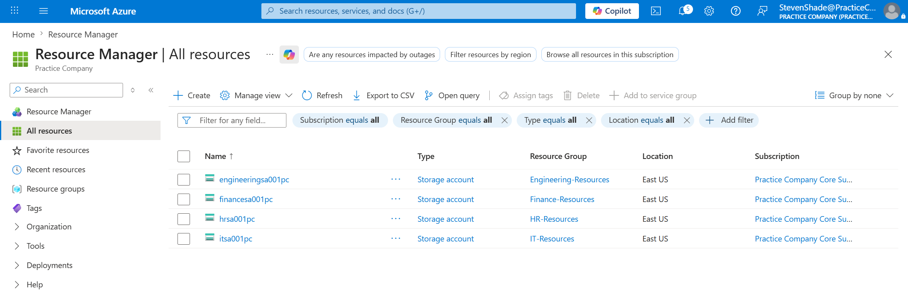
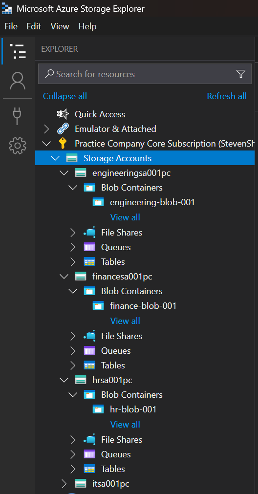
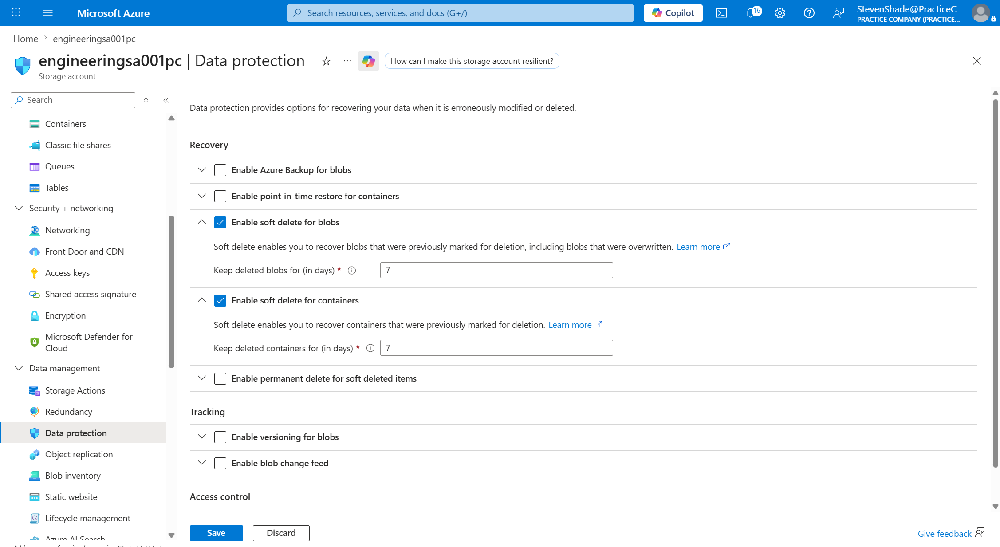
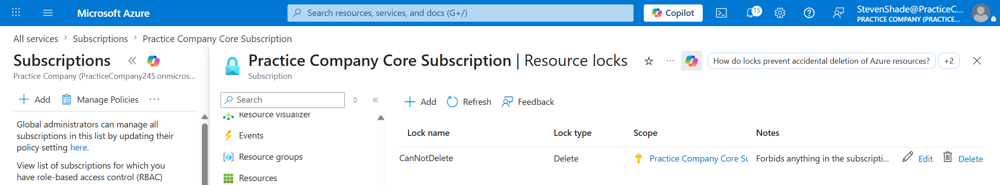

# Phase 2: Storage Infrastructure

## Business Scenario
`Practice Company` needs a storage infrastructure to hold a variety of company data. Storage needs to be cost-effective, secure, and shareable with other companies. 

## Step-by-Step Implementation
### Step 1: Automate Storage Account Creation 
To reduce production time, a PowerShell script was created to automate the creation of a storage account for each department. To meet company requirements, the location for the storage accounts was set to `EastUs` and `LRS` was used for data redundancy and cost-effectiveness:

```powershell
$Departments = @(
	[PSCustomObject]@{Department = "engineering"; ResourceGroup = "Engineering-Resources"},
	[PSCustomObject]@{Department = "finance"; ResourceGroup = "Finance-Resources"},
	[PSCustomObject]@{Department = "hr"; ResourceGroup = "HR-Resources"},
	[PSCustomObject]@{Department = "it"; ResourceGroup = "IT-Resources"}
)

Connect-AzAccount 

foreach ($Dept in $Departments)
{
	$StorageAccountParams = @{
		StorageAccountName = "$($Dept.Department)sa001pc"
		ResourceGroupName = $Dept.ResourceGroup
		Location = "EastUs"
		SkuName = "Standard_LRS"
	}
	New-AzStorageAccount @StorageAccountParams -AllowBlobPublicAccess $False
}
```
*Figure 1: A PowerShell script to automate the creation of storage accounts for each department in the company.*

Selecting **All Resources** will show that each storage account was created with the appropriate naming: 


*Figure 2: Image showing the successful creation of all storage accounts created by the PowerShell script.*

### Step 2: Create Blob Containers Using Azure Storage Explorer
Company administration would like each department to have a blob container in each storage account to hold general data. The Azure portal, however, is having some issues and won't allow the tenant administrator to create the blob containers. As a workaround, Azure Storage Explorer was installed, connected to the company's subscription, and a blob container was created for the storage accounts:



*Figure 3: Using the Azure Storage Explorer to create blob containers for each storage account.*

Oh no! The Azure portal and the Azure Storage Explorer are both having issues, and the final blob container could not be created for the IT department. As a workaround, a basic PowerShell script was executed to attempt to create the blob container:

```powershell
Connect-AzAccount

$ResourceGroup = "IT-Resources"
$StorageAccountName = "itsa001pc"
$ContainerName = "it-blob-001"
$Context = (Get-AzStorageAccount -ResourceGroupName $ResourceGroup -AccountName $StorageAccountName).Context;

New-AzStorageContainer -Name $ContainerName -Context $Context
```
*Figure 4: The PowerShell script used to create the last blob container for the IT department while the Azure Portal and Storage Explorer were not working.*

Luckily, running the script was successful and provisioned the blob container in the appropriate storage account.
```plaintext
Subscription name                  Tenant
-----------------                  ------
Practice Company Core Subscription Practice Company

CloudBlobContainer      : Microsoft.Azure.Storage.Blob.CloudBlobContainer
Permission              : Microsoft.Azure.Storage.Blob.BlobContainerPermissions
AccessPolicy            :
PublicAccess            : Off
LastModified            : 6/26/2026 7:59:50 PM +00:00
ContinuationToken       :
IsDeleted               :
VersionId               :
BlobContainerClient     : Azure.Storage.Blobs.BlobContainerClient
BlobContainerProperties : Azure.Storage.Blobs.Models.BlobContainerProperties
Context                 : Microsoft.WindowsAzure.Commands.Storage.Common.AzureStorageContext
Name                    : it-blob-001
```
*Figure 5: Successfully created blob container from the PowerShell script.*

### Step 3: Enabling Soft Delete and Resource Locks
An employee in the Engineering department jokingly mentioned that he nearly deleted resources in the `engineering-blob-001` blob. For data protection, **soft delete** was enabled for both blobs and containers, allowing data to be restored for each department.


*Figure 6: Soft delete enabled for blobs and containers.*

The company administration would like for more safeguards to be in place to prevent the accidental deletion of any resources in the Azure tenant, both current and future resources. Rather than place a resource lock on each resource group, a lock was implemented at the subscription level, preventing current resources from being deleted, and preventing the deletion of future resources provisioned to the subscription. 


*Figure 7: A resource lock set at the subscription level, preventing current and future resources from being deleted.*

### Step 4: Granting External Business Access (SAS Token)
An external company collaborating with the `Practice Company` needs to view the resources listed in the Engineering department's storage account. `Practice Company` administration requires that the external business be able to access the files for no more than 3 days. An **SAS Token** was generated to meet the requirement, allowing and it was provisioned with a start/expiry date of 3 days. 


*Figure 8: An SAS Token generated for an external business to connect to the Engineering department's storage account.**

The SAS Token was tested in the Azure Storage Explorer app. Selecting the "open connect dialog," a name for the storage account was given and the connection string was pasted in.


*Figure 9: Entering the connection string to connect to the Engineering department's storage account.*

The connection was established, and the resources in the storage account were accessible, as shown in the image below. 


*Figure 10: The connection is extablished and the resources in the storage account are now accessible.* 

